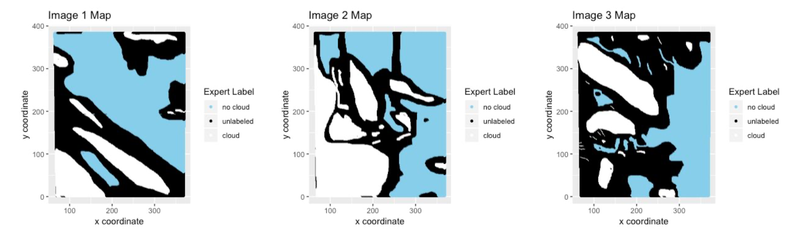
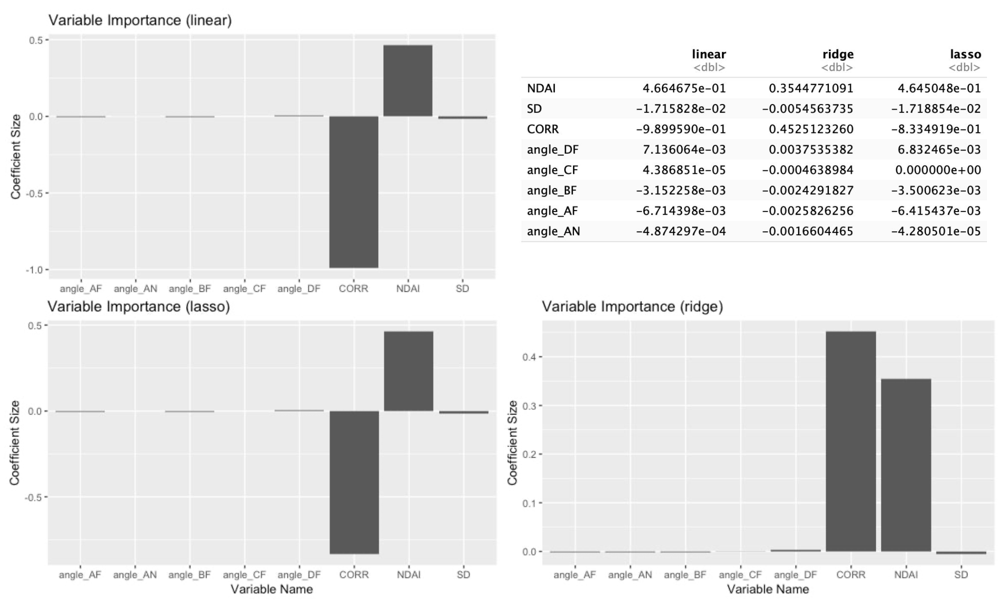

# Cloud Classifier

With Arctic cloud cover data, the goal was to identify any corrupted data points and improve the efficiency of cloud detection. Created classifiers utilizing many different data split types for training/test data splitting (e.g. PCA, random sampling), as well as many different model types (e.g. logistic, LDA/QDA, SVM) to identify the best classifier, which was able to correctly identify 89% of corrupted points, a 15-20% improvement over a trivial classifier.

To produce the images in the report, run the code. Comments in the code state what the code chunk does. Run all of the code to get the necessary images.

The document was created in Google Docs/Word, so images and values were inserted manually. Some of the images are admittedly out of place because we converted a Google Doc to a Word document, but you can use the pdf as reference to where to put images. Below are where to get the images in the code:

- Image set 1 (maps): code starting on line 63
- Image set 2 (overall correlation matrix): code starting on line 96
- Image set 3 (correlation matrices for labels): code starting on line 106
- Image set 4 (box plots): code starting on line 123
- Image set 5 (variable importance plots): code starting on line 362
- Image set 6 (VIF values): code starting on line 545
- Image set 7 (logic plots): code starting on line 551
- Image set 8 (variable histogram): code starting on line 637
- Image set 9 (covariance matrix): code starting on line 655
- Image set 10 (ROC curves + values): code starting on line 848, should be the next four chunks
- Image set 11 (variable importance for split methods): code starting on line 897 and 918
- Image set 12 (misclassified histograms): code starting on line 934 and 947

And here are where to get the numbers to put into tables:
- Table 1 (Accuracy of trivial classifier): code starting on line 316
- Table 2 (Split method 1 accuracies): code starting on line 477 (log reg CV), line 501 (log reg test), line 571 (LDA CV), line 595 (LDA test), line 660 (QDA CV), line 684 (QDA test), line 750 (SVM CV), line 775 (SVM test)
- Table 3 (Split method 2 accuracies): code starting on line 511 (log reg CV), line 535 (log reg test), line 604 (LDA CV), line 628 (LDA test), line 693 (QDA CV), line 717 (QDA test), line 810 (SVM CV), line 835 (SVM test)
- Table 4 (Other split method 1 accuracies): code starting on line 1036 (second column)
- Table 5 (Other split method 2 accuracies): code starting on line 1169 (second column)

# Tools
R was the main language used for analysis. R Studio was used for programming along with packages such as tidyverse and ggplot.